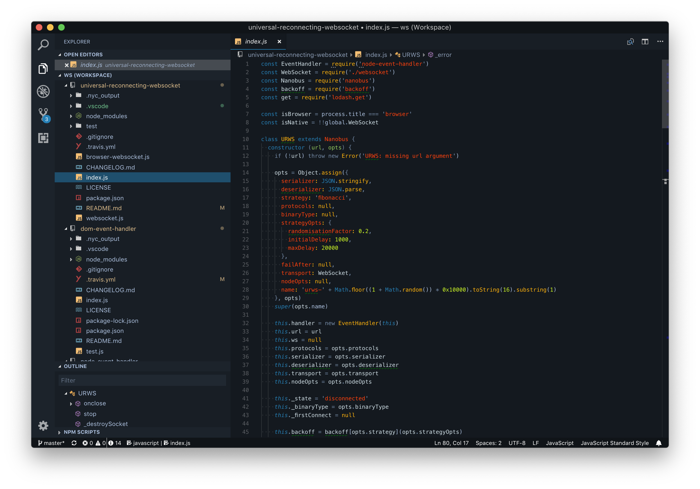

# Tron Legacy for VSCode

A hand edited port of the Tron Legacy theme.

## Development

For general information see [vsc-extension-quickstart.md](vsc-extension-quickstart.md).

## See also

### Theming info:

- [VSCode Themes](https://code.visualstudio.com/docs/getstarted/themes)
- [Theme Color Reference](https://code.visualstudio.com/docs/getstarted/theme-color-reference)
- [themes-snippets-colorizers](https://code.visualstudio.com/docs/extensions/themes-snippets-colorizers#_textmate-theme-rules)
-  Developer: Inspect TM Scopes to view scopes
- [Scope naming overview](https://www.sublimetext.com/docs/3/scope_naming.html)
- [Yo code generator](https://code.visualstudio.com/docs/extensions/yocode)
- [Workbench Release notes](https://code.visualstudio.com/updates/v1_12#_workbench)
- [vscode-theme-generator](https://github.com/Tyriar/vscode-theme-generator)
- [extension-manifest](https://code.visualstudio.com/docs/extensionAPI/extension-manifest)
- [publish-extension](https://code.visualstudio.com/docs/extensions/publish-extension)
- [PAT Dashbaord](https://bcomnes.visualstudio.com/)

### Extensions overview

- [extension-points#_contributescolors](https://code.visualstudio.com/docs/extensionAPI/extension-points#_contributescolors)
- [Extensions overview](https://code.visualstudio.com/docs/extensions/overview)

### Other IDEs

- [bcomnes/atom-tron-legacy](https://github.com/bcomnes/atom-tron-legacy)
- [bcomnes/sublime-tron-color-scheme](https://github.com/bcomnes/sublime-tron-color-scheme)

## Licence

MIT

© Bret Comnes and original theme authors
